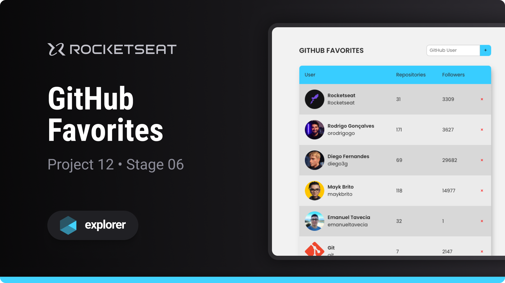

# GitHub Favorites

Project developed on Rocketseat's Explorer course

**GitHub Favorites is a website that allows you to favorite GitHub users, designed to learn basic JavaScript programming concepts**

## 🔗 Project Links

- 🚀 [**Deploy**](https://emanueltavecia.github.io/github-favorites)

## 📋 Project information

- Rocketseat Explorer
- Stage 06
- Project 12

## 🧠 Concepts learned

The development of this project aims to learn the following concepts:

- Asynchronous JavaScript Programming
- Object Oriented Programming (OOP)
- Classes
- Local Storage
- Events and Interactivity
- API Consumption
- Promises

## 💻 Technologies

## 📄 License

This project is licensed under the MIT License - see the [LICENSE](./LICENSE) file for more details.
